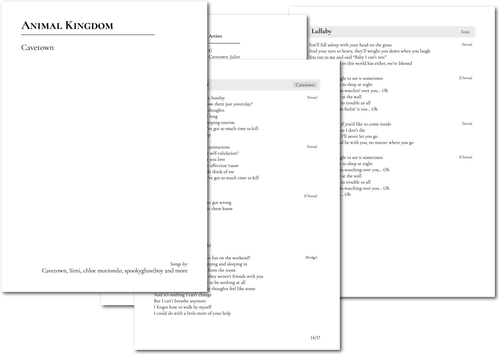

# TiefLied



> _Lied (\[liːt\]), German for Song_

A template to make halfway decent songbooks in a markup language that people can actually read.

TiefLied is developed by Lena Tauchner (Tiefseetauchner) for use in making "hits" booklets for herself.

## Planned features

- [ ] Chords

## Usage

To use TiefLied with the Typst web app, choose "Start from template" and select TiefLied. You will also need to include or install the Cormorant Garamond and Cormorant SC Fonts, should you chose to not change the default font.

To import the package manually in your Typst project, use:

```typst
#import "@preview/tieflied:0.2.0": songbook, song
```

Alternatively, you can download the `lib.typ` file and use:

```typst
#import "lib.typ": songbook, song
```

## Exported Members

### Primary Layouting

The primary layouting consideres multiple `songs` in a `songbook` (Liederbuch).

`songbook`: The main class setting layouting.

```typst
#songbook(
  title: "Book Name", // Title on the title page.
  songbook-author: "Book Author", // Author under title on the title page
  title-page: false, // Display title page with Title, Author and Artists
  settings: (
    paper: "a4", // Default page size setting
    font: "Cormorant Garamond", // Default font
    title-font: "Cormorant SC", // Font for specifically the title
    text-size: 14pt, // Default text size
    show-annotations: false, // Show annotations of verses etc.
    page-per-song: false, // Start a new page per song
    start-right: true, // Skip a page after title
    index-by-author: false, // Create an index sorted and grouped by authors
    index-by-title: true, // Create an index sorted and grouped by title
  ),
  [ ... ] // Body, should contain songs
)
```

`author`: A helper to create and save an author dictionary. Can be simplified and written as a dictionary.

```typst
#author(
  name: "Cavetown", // Name of a song author
  color: color.hsv(178.6deg, 16.86%, 100%), // Color of the author
    // Used in the bubble of a song title
)
```

`song`: Primary layouting for songs.

```typst
#song(
  author: song-author, // Author of the song, also used for the artists display
  title: none, // Title of the song
  [ ... ] // Content of the song, can be text or macros
)
```

`set-page-breaking`: Resets whether a new page should be started per song. Can be used inbetween songs to change behaviour throughout book.

```typst
#set-page-breaking(true)
```

### Annotations

Annotations not only serve the orientation but also the formatting of the text. You can put blocks of text (verses, choruses, bridges, outros, ...) in annotation blocks. If `show-annotations` in the `settings` of the `songbook` is `true`, an annotation will be drawn in the right margin.

`annotation`: General annotation with custom text.

```typst
#annotation("[Outro]")[ ... ]
```

`verse`: Verse Annotation. Usage below.\
`bridge`: Bridge Annotation. Usage below.\
`chorus`: Chorus Annotation. Usage below.

```typst
#verse[ ... ]
#bridge[ ... ]
#chorus[ ... ]
```

## Example

```typst
#import "@preview/tieflied:0.2.0": annotation, author, bridge, chorus, set-page-breaking, song, songbook, verse

#let cavetown = author(
  "Cavetown",
  color: color.hsv(178.6deg, 16.86%, 100%),
)

#songbook(
  title: "Animal Kingdom",
  songbook-author: "Cavetown",
  title-page: true,
  settings: (
    show-annotations: true,
    page-per-song: true,
    start-right: false,
  ),
  [
    #song(author: cavetown, title: "Juliet", [
      #verse[
        I need to cry, but I can't\
        Get anything out of my eyes or my head\
        Did I die?\
        I need to run, but I can't\
        Get out of bed for anyone\
        Not for you, ooh
      ]
      ...
    ])
  ]
)
```

## License and Contributions

TiefLied is currently under active development. Feedback, bug reports, and suggestions are welcome. Please open an issue or contribute via pull requests if you have ideas for improvement.

This package is released under the MIT License.
